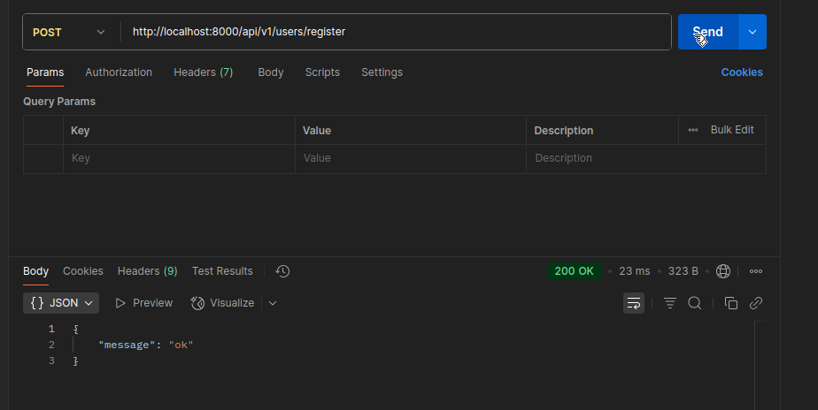

# Router and controller

Inside src/utils create a file named `asyncHandler.js` and inside it write this
```javascript
const asyncHandler = (requestHandler) => {
    return (req, res, next) => {
        Promise.resolve(requestHandler(req, res, next)).catch(next);
    };
};

export default asyncHandler;
```

Now inside src create a directory named controllers and inside it a file named user.controller.js. In `user.controller.js` write this
```javascript
import asyncHandler from "../utils/asyncHandler.js";
const registerUser = asyncHandler( async (req, res) => {
    res.status(200).json({
        message: "ok"
    })
})
export default registerUser;
```
Now inside src create a directory named routes and inside it a file named user.route.js. In `user.route.js` write this
```javascript
import { Router } from "express";
import registerUser from "../controllers/user.controller.js";

const userRouter = Router();
userRouter.route("/register").post(registerUser);

export default userRouter;
```

Now go to `src/app.js` and add these lines
```javascript
import userRouter from "./routes/user.route.js"
app.use("/api/v1/users", userRouter);
```
So basically we will get the **register** page at **http://localhost:8000/api/v1/users/register**

## Some less related points
### JavaScript Default Export and Curly Braces Usage

#### 📦 Default Export

- A module can have **only one default export**.
- Use it to export the **main value/function/class** from a module.

#### Syntax

```js
// utils.js
export default function greet() {
    console.log("Hello");
}
```

```js
// app.js
import greet from './utils.js'; // ✅ No curly braces
```

---

#### 🧩 Named Export

- A module can have **multiple named exports**.
- Use curly braces `{}` when importing them.
- You **must use the exact name** when importing.

#### Syntax

```js
// utils.js
export function greet() {
    console.log("Hello");
}
export const name = "ChatGPT";
```

```js
// app.js
import { greet, name } from './utils.js'; // ✅ Use curly braces
```

---

#### 🔁 Mixed Exports

You can mix default and named exports in the same file:

```js
// utils.js
export default function greet() {}
export const name = "ChatGPT";
```

```js
// app.js
import greet, { name } from './utils.js';
```

---

#### ✅ Summary

| Export Type    | Export Syntax               | Import Syntax                  | Curly Braces |
|----------------|------------------------------|----------------------------------|---------------|
| Default        | `export default ...`         | `import x from '...'`           | ❌ No         |
| Named          | `export const x = ...`       | `import { x } from '...'`       | ✅ Yes        |
| Mixed          | `export default ..., export` | `import x, { y } from '...'`    | ✅ Yes (for named) |

---
# API testing (basics)
Download postman. In ubuntu, you can type this
```bash
sudo snap install postman
```
